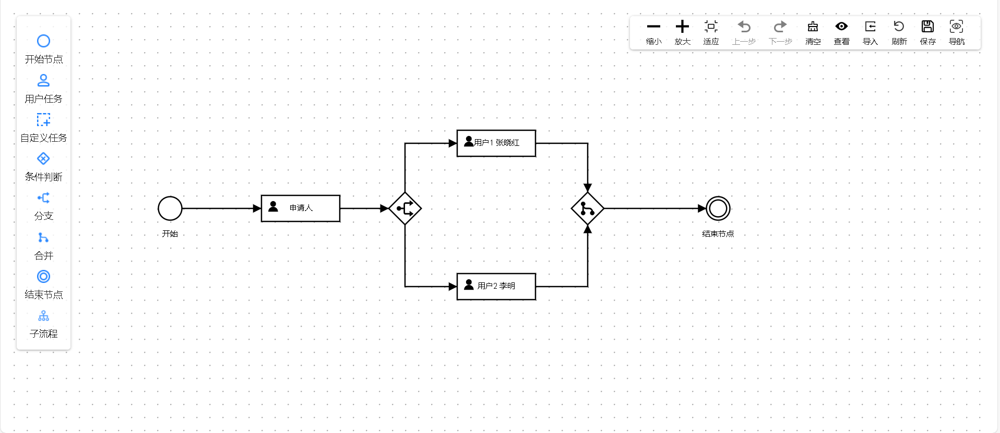

# Ingenious 工作流引擎

#### 介绍
Ingenious 的核心特点之一是其灵活性。它支持多种类型的任务和活动，包括人工任务、自动化任务和决策任务。您可以根据实际需求自定义任务的执行逻辑，并灵活地调整工作流程，以适应不同的业务场景。此外，Ingenious还提供了丰富的插件和扩展机制，使您能够根据需要扩展其功能和集成其他系统。

#### 主要特性
*  采用PHP8强类型（严格模式）
*  升级PSR规范依赖版本
*  支持PHP主流框架【ThinkPHP,Webman,Laraver】
*  支持主流设计器【logicFlow,AntV X6】
*  支持 前置后置拦截器 表达式 会签 会签条件 合并 分支  抄送 子流程 自定义任务 委托 时限 任务调度

#### 安装
*  安装Composer
*  composer require ingen/ingenious
*  开源不易，知识付费  详细教程请购买文档 [购买](https://pc.fenchuan8.com/#/index?forum=69121&yqm=M9RJ)

#### 相关Demo截图

#### ⭐交流群

交流群①：321796659

#### 链接

*  Gitee:https://gitee.com/ingenstream/ingenious 【主要】

*  Github:https://github.com/kzhzjdyw888/ingenious 【同步】

*  官方:http://www.ingenstream.cn/

*  演示:http://layui.flow.thinkphp.ingenstream.cn/

*  手册:http://flow.doc.ingenstream.cn/#/zh-cn/  【付费】

*  圈子:https://pc.fenchuan8.com/#/index?forum=77206&yqm=M9RJ

*  专栏:https://pc.fenchuan8.com/#/index?forum=69121&yqm=M9RJ 【付费】

~~~
对您有帮助的话，你可以在下方赞助我们，让我们更好的维护开发，谢谢！
特别声明：坚决打击网络诈骗行为，严禁将本插件集成在任何违法违规的程序上。
~~~

如果对您有帮助，您可以点右上角 💘Star💘支持
