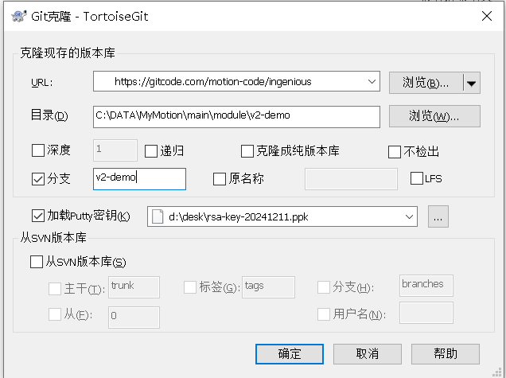
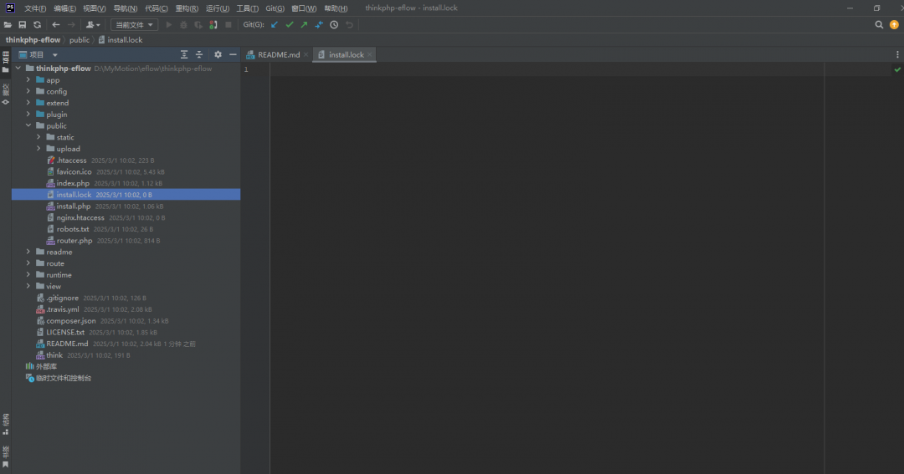
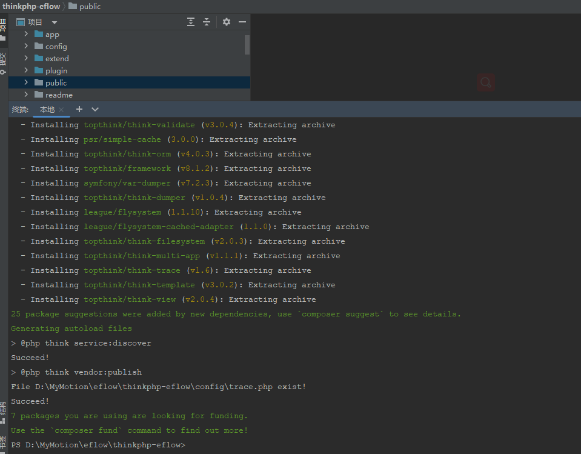
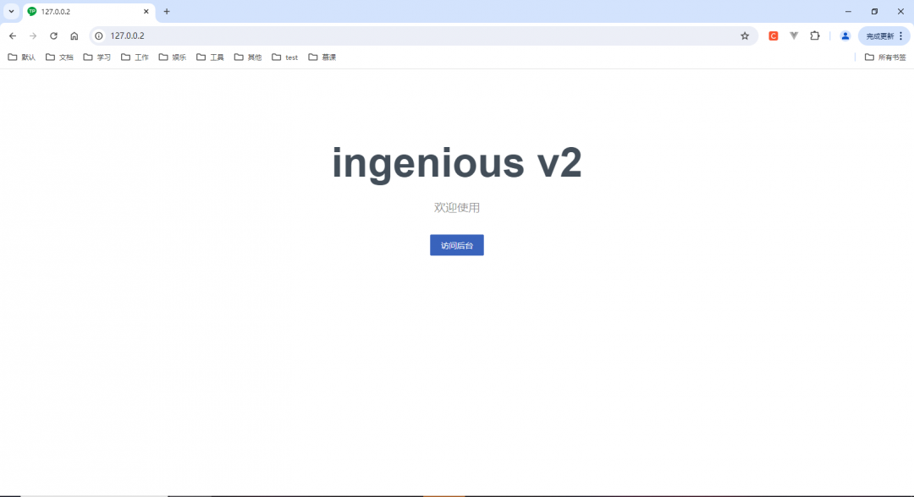
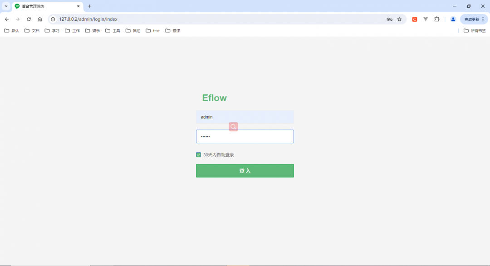
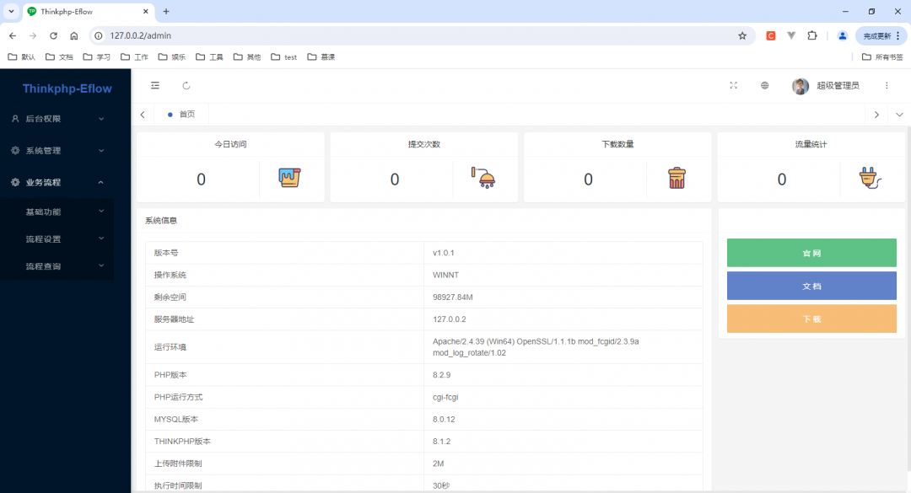

## 1.获取源码
https://gitcode.com/eflow/think-eflow 


- 这里分支一般会默认主分支，我这边涉及多个平台镜像做了一个填充操作可忽略。



## 2.部署
thinkphp非脚本模式，我这边展示最简单的小皮来部署。
- 设置php版本^8.1
- 设置入口public
- 设置伪静态

```
<IfModule mod_rewrite.c>
  Options +FollowSymlinks -Multiviews
  RewriteEngine On

  RewriteCond %{REQUEST_FILENAME} !-d
  RewriteCond %{REQUEST_FILENAME} !-f
  RewriteRule ^(.*)$ index.php?/$1 [QSA,PT,L]
</IfModule>
```

## 3.安装


- 删除public 入口目录下的install.lock
- 切换根目录执行composer install


- 完成后我们之间进入小皮设置的访问地址127.0.0.1，必须删除install.lock要不然直接进入后台页面了。注：env打开调试模式 才有crud生成页面功能






注：env打开调试模式 才有crud生成页面功能
